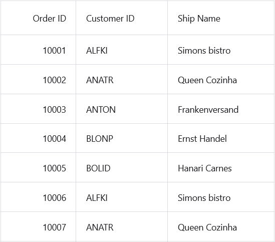

# How to populate data using WebAPI in MAUI DataGrid?
The [.NET MAUI DataGrid](https://www.syncfusion.com/maui-controls/maui-datagrid) supports binding the item source from a Web API.

##### C#
Create a **JSON** data model.

**OrderInfo**
```C#
public class OrderInfo
{
    public int OrderID { get; set; }
    public string? CustomerID { get; set; }
    public int EmployeeID { get; set; }
    public double Freight { get; set; }
    public string? ShipCity { get; set; }
    public bool Verified { get; set; }
    public DateTime OrderDate { get; set; }
    public string? ShipName { get; set; }
    public string? ShipCountry { get; set; }
    public DateTime ShippedDate { get; set; }
    public string? ShipAddress { get; set; }
}
```
Create a WebApiServices class within the Services folder.

**WebApiServices**

Utilize the webApiUrl to retrive the data using the ReadDataAsync() function. Read the response using the **ReadAsStringAsync()** method and deserialize the JSON object using the [Newtonsoft.Json](https://www.nuget.org/packages/Newtonsoft.Json) package.

```C#
internal class WebApiServices
{
    #region Fields

    public static string webApiUrl = "https://ej2services.syncfusion.com/production/web-services/api/Orders"; // Your Web Api here

    HttpClient client;

    #endregion

    #region Constructor

    public WebApiServices()
    {
        client = new HttpClient();
    }

    #endregion

    #region RefreshDataAsync

    /// <summary>
    /// Retrieves data from the web service.
    /// </summary>
    /// <returns>Returns the ObservableCollection.</returns>
    public async Task<ObservableCollection<OrderInfo>>? ReadDataAsync()
    {
        var uri = new Uri(webApiUrl);
        try
        {
            //Sends request to retrieve data from the web service for the specified Uri
            var response = await client.GetAsync(uri);

            if (response.IsSuccessStatusCode)
            {
                var content = await response.Content.ReadAsStringAsync(); //Returns the response as JSON string
                return JsonConvert.DeserializeObject<ObservableCollection<OrderInfo>>(content)!; //Converts JSON string to ObservableCollection
            }
        }
        catch (Exception ex)
        {
            System.Diagnostics.Debug.WriteLine(@"ERROR {0}", ex.Message);
        }

        return null;
    }
    
    #endregion
}
```

**OrderInfoViewModel**

Populate the data using the ReadDataAsync() in the viewmodel.

```C#
private async void GenerateData()
{
    OrderInfoCollection = await webApiServices.ReadDataAsync()!;
}
```

The following screenshot shows how to to populate data using WebAPI in MAUI DataGrid.



[View sample in GitHub](https://github.com/SyncfusionExamples/How-to-populate-data-using-WebAPI-in-MAUI-DataGrid)

Take a moment to pursue this [documentation](https://help.syncfusion.com/maui/datagrid/overview), where you can find more about Syncfusion .NET MAUI DataGrid (SfDataGrid) with code examples.
Please refer to this [link](https://www.syncfusion.com/maui-controls/maui-datagrid) to learn about the essential features of Syncfusion .NET MAUI DataGrid(SfDataGrid).

### Conclusion
I hope you enjoyed learning about how to populate data using WebAPI in MAUI DataGrid.

You can refer to our [.NET MAUI DataGrid's feature tour](https://www.syncfusion.com/maui-controls/maui-datagrid) page to know about its other groundbreaking feature representations. You can also explore our .NET MAUI DataGrid Documentation to understand how to present and manipulate data.
For current customers, you can check out our .NET MAUI components from the [License and Downloads](https://www.syncfusion.com/account/downloads) page. If you are new to Syncfusion, you can try our 30-day free trial to check out our .NET MAUI DataGrid and other .NET MAUI components.
If you have any queries or require clarifications, please let us know in comments below. You can also contact us through our [support forums](https://www.syncfusion.com/forums), [Direct-Trac](https://support.syncfusion.com/account/login?ReturnUrl=%2Faccount%2Fconnect%2Fauthorize%2Fcallback%3Fclient_id%3Dc54e52f3eb3cde0c3f20474f1bc179ed%26redirect_uri%3Dhttps%253A%252F%252Fsupport.syncfusion.com%252Fagent%252Flogincallback%26response_type%3Dcode%26scope%3Dopenid%2520profile%2520agent.api%2520integration.api%2520offline_access%2520kb.api%26state%3D8db41f98953a4d9ba40407b150ad4cf2%26code_challenge%3DvwHoT64z2h21eP_A9g7JWtr3vp3iPrvSjfh5hN5C7IE%26code_challenge_method%3DS256%26response_mode%3Dquery) or [feedback portal](https://www.syncfusion.com/feedback/maui?control=sfdatagrid). We are always happy to assist you!